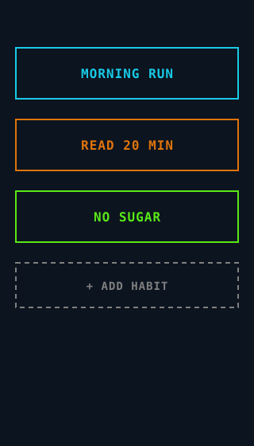
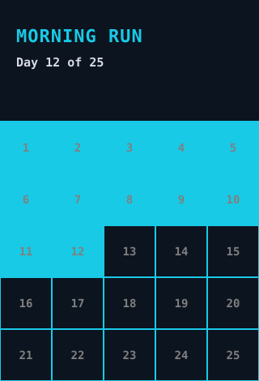
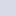

# Dinumero

A minimalist iOS habit tracker

<table align="center">
<tr>
<td align="center" valign="middle"><strong>Habit list</strong><br><br></td>
<td align="center" valign="middle"><strong>Habit detail</strong><br><br></td>
</tr>
</table>

## Features

* Custom Habit - Choose the title, length, and colour theme for each habit.

* Minimalist Tracking - Just tap the current day to indicate a complete habit

### Palette

| Role | Swatch | Hex |
|---|---|---|
| Background |  | `#0C141F` |
| Text |  | `#D8DAE7` |
| Secondary text |  | `#808080` |
| Accent |  | `#E6FFFF` |
| Blue |  | `#18CAE6` |
| Orange |  | `#DF740C` |
| Yellow |  | `#FFE64D` |
| Green |  | `#59E817` |
| Purple |  | `#7D12FF` |

## Requirements

* A device/simulator with iOS > 17

## Build
To compile with Xcode:

```sh
open Dinumero.xcodeproj          # then ⌘R
```

Or from the command line:

```sh
xcodebuild -scheme Dinumero -destination 'generic/platform=iOS Simulator' build
xcodebuild -scheme Dinumero -destination 'platform=iOS Simulator,name=iPhone 16' test
```

## Future Features
* Track current streak
* Customise the display to reduce further
* Multiple times per day habits
